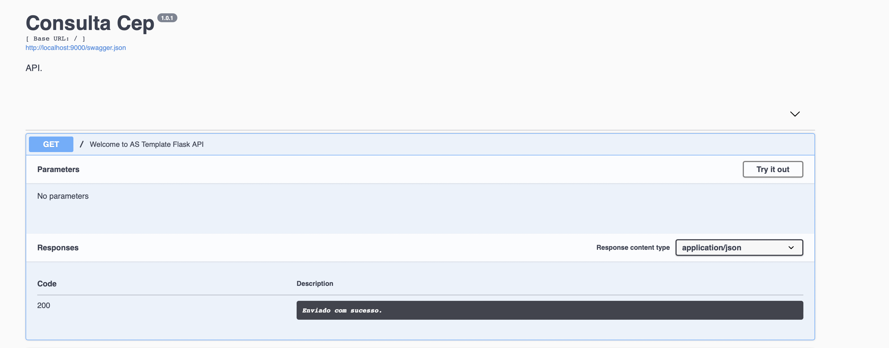
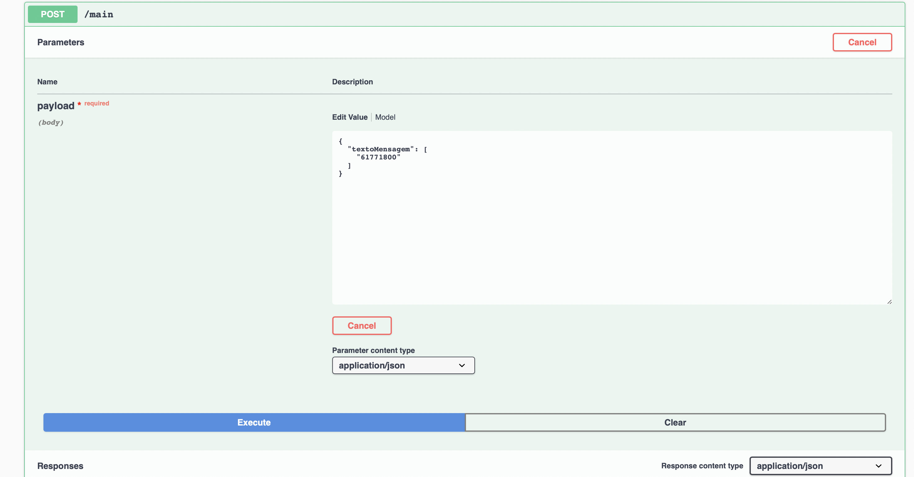
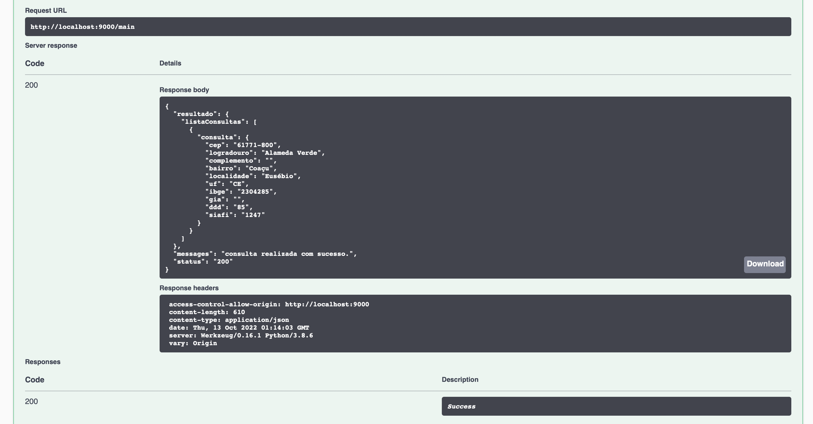

# api-consultaCep

- Projeto que sobe um Container e, neste, uma API RESTful com o Swagger
- Consumindo o serviço da API ViaCEP para retornar informações referente ao Cep digitado

## Getting Started

Para executar a aplicação, basta compilar o Docker e executar o mesmo com os seguintes comandos

```
docker compose build
docker compose up
```

## Autores

* **Patrick Luiz** - *Trabalho inicial*
* **Karine Fernandes** - *Mudificação de serviço*

## Exemplo de consulta








